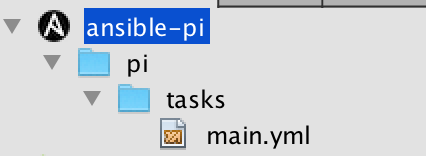

# Ansible Module for Netbeans

* WIP
* roughly based on:
  * [NetBeans Project Type Module Tutorial](https://platform.netbeans.org/tutorials/nbm-projecttype.html)
  * [NetBeans Project Type Extension Module Tutorial](https://platform.netbeans.org/tutorials/nbm-projectextension.html)
  * [NetBeans Code Completion Tutorial](https://platform.netbeans.org/tutorials/nbm-code-completion.html)
  * …
  * [Ansible Project - Best Practices](http://docs.ansible.com/ansible/playbooks_best_practices.html)
  * …
  
## current State

Project Listing already works!

